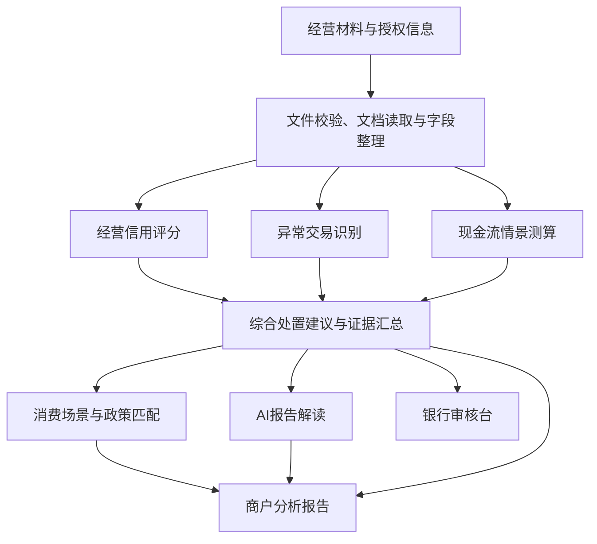

# 商E贷

**经营授信 · 消费引介 · 贷后监测**

让经营数据形成信用，让金融服务带来订单。

商E贷是面向美容美发、宠物服务、家政等小微服务商户的一体化金融服务方案。项目融合商户经营流水、订单、财务、纳税与评价投诉信息，以可解释的风险决策体系形成授信建议，联动工行消费场景与政策资源，将融资支持、经营促活和动态复评连接为持续服务闭环。

[演示指引](#演示指引) · [技术亮点](#技术亮点) · [快速运行](#快速运行) · [浏览源码](https://github.com/wes1612/ICBC-conve-loan/tree/ui-revised-0819)

## 三个值得关注的亮点

### AI Agent“工小信”：让办理与结果理解更高效

“工小信”根据申请步骤、材料状态和分析结果回答商户问题，解释材料要求、授权用途与评分依据。报告智能解读将结构化结果组织成经营优势、风险线索、资金需求和办理建议，并关联对应证据，让商户与客户经理在同一份事实基础上沟通。

### 双端可视化报告：从经营画像到决策依据

商户端集中展示经营信用分、建议额度、维度画像、消费承接与政策推荐；银行审核台展示规则命中、异常交易证据、现金流压力及复核动作。统一的后端结果支撑两种视图，每项关键判断均可回查数据与规则依据。

### 消费引介闭环：让授信与经营增长协同

服务方案将工行消费券、企业员工福利、合作渠道及政策资源与商户行业、地区、经营需求和承接能力匹配。核销、复购、退款、投诉与还款表现进入经营反馈，支持持续服务和授信复评，形成“数据增信、精准授信、消费促活、动态风控”的循环。

## 服务如何展开

**授信前：规范材料，汇集经营证据。** 方案衔接工行企业管家云与工行合作的持证代理记账机构，协助商户归集凭证、形成财务报表；商户提交主体及经营材料，并完成数据使用授权。

**计算流程中：统一分析，输出可解释建议。** 系统交叉核验多源信息，运行经营评分、异常识别与现金流情景测算，结合资金用途形成额度、期限及还款方式建议，由银行人员依据证据开展复核。

**授信后：引入消费，持续复评。** 方案配置消费引介与政策服务，将经营、活动和还款表现按时间更新，支持客户经理跟进商户、识别经营变化并评估额度调整。

## 技术亮点

### 可解释的多引擎风险决策体系

| 分析模块 | 核心方法 | 输出价值 |
| --- | --- | --- |
| 经营信用评分 | 多源特征计算、v5评分卡、额度映射与规则门控 | 经营分层、建议额度、置信度和复核依据 |
| 异常交易识别 | 业务规则与MAD稳健离群检测 | 异常原因码、关联交易和证据链 |
| 现金流情景测算 | 加权基线、阻尼趋势与压力情景 | 未来三个月现金变化、资金缺口和需求驱动 |
| 消费与政策匹配 | 行业、地区、用途、资格与有效期规则 | 消费场景方案、政策推荐及申请材料要求 |

### 统一计算与证据驱动的AI协作



后端统一计算评分、额度和综合处置建议，前端按同一接口契约呈现结果。大语言模型接收经过筛选的状态与结果摘要，输出内容经过结构、数字和证据编号校验。材料编号、SHA256摘要、规则版本和模型调用记录共同支撑分析回查。

### 结构化与非结构化信息协同

结构化数据覆盖商户基础信息、月度经营序列、财务税务快照和发票校验；非结构化数据覆盖评价、社媒与投诉。评价样本同时保留原始评论、圆形红色词云、五个高频关键词、综合打分和定性摘要，为经营画像提供文本证据。

技术栈：**React + TypeScript + Vite / Python + FastAPI / SQLite / 大语言模型服务**。SQLite承载结构化与评价数据样本，JSON组织交易明细、现金流及政策资源，后端v5引擎统一执行评分规则。

## 演示指引

仓库提供五个模拟商户、553笔模拟交易、60条月度现金流记录，以及每商户200条模拟评价和对应词云，用于情景演示、接口联调与规则验证。网页提供 `M001`、`M005` 两条内置材料演示路径。

| 推荐观看内容 | 操作入口 | 关注点 |
| --- | --- | --- |
| AI助手交互 | 申请流程右侧“流程助手” | 结合当前步骤回答材料、授权与结果问题 |
| 商户结果页面 | `M001` → 授信报告 → 商户摘要 | 经营画像、建议额度、AI解读与消费推荐 |
| 银行审核页面 | `M005` → 授信报告 → 银行审核台 | 规则命中、交易证据、资金缺口与人工复核 |

完整操作路径：**选择案例 → 基本信息 → 演示身份核验 → 载入样例材料 → 数据授权 → 运行综合分析 → 查看报告与智能解读**。

[查看图文操作说明](https://github.com/wes1612/ICBC-conve-loan/blob/ui-revised-0819/docs/模拟网站使用说明.md)

## 快速运行

<details>
<summary>展开本地启动与AI配置说明</summary>

环境：Python 3.11及以上、Node.js 20及以上、Git。以下命令在PowerShell中执行，源码使用 `ui-revised-0819` 分支。

**获取源码**

```powershell
git clone --branch ui-revised-0819 https://github.com/wes1612/ICBC-conve-loan.git
cd ICBC-conve-loan
```

**终端一：启动后端**

```powershell
cd backend
python -m venv venv
.\venv\Scripts\python.exe -m pip install -r requirements.txt
.\venv\Scripts\python.exe -m uvicorn app.main:app --reload --port 8000
```

**终端二：从仓库根目录启动前端**

```powershell
cd frontend
npm install
npm run dev -- --port 5173 --strictPort
```

打开 [应用页面](http://localhost:5173)，后端提供 [健康检查](http://127.0.0.1:8000/health) 和 [API文档](http://127.0.0.1:8000/docs)。

**配置AI交互与报告解读**

在仓库根目录复制配置模板：

```powershell
Copy-Item .env.example .env
```

在 `.env` 中填写 `ICBC_AI_PROVIDER`、`ICBC_AI_MODEL` 和 `ICBC_AI_API_KEY`，分别指定供应商、模型名称和访问密钥；后端自动读取配置。访问密钥由服务端管理。配置完成后重新启动后端。

详细说明：[AI配置与工作流](https://github.com/wes1612/ICBC-conve-loan/blob/ui-revised-0819/docs/AI-MVP-implementation.md)。

**运行后端验收**

在后端目录执行：

```powershell
.\venv\Scripts\python.exe -m pytest -q
```

</details>

## 仓库导航

```text
frontend/          商户申请、AI交互、分析报告与银行审核界面
backend/app/       材料处理、统一分析、评分引擎及AI服务
backend/tests/     评分、异常、现金流、材料与接口验收
backend/training/  训练数据构建与本地模型训练工具
data/Structured/   财务税务、月度经营数据及SQL表结构
data/Unstructured/ 评价样本、词云、报告与测试脚本
data/ml_simulated/ 交易明细与月度现金流样本
data/policies/     政策条目、银行活动与匹配规则
docs/              演示指引、接口契约及技术说明
```

| 进一步了解 | 阅读入口 |
| --- | --- |
| 后端接口与评分规则 | [后端说明](https://github.com/wes1612/ICBC-conve-loan/blob/ui-revised-0819/backend/README.md) |
| 统一评分口径 | [v5评分口径说明](https://github.com/wes1612/ICBC-conve-loan/blob/ui-revised-0819/docs/v5评分口径统一说明.md) |
| 输入与输出示例 | [API示例](https://github.com/wes1612/ICBC-conve-loan/tree/ui-revised-0819/docs/api_examples) |
| 数据字典与商户样本 | [数据说明](https://github.com/wes1612/ICBC-conve-loan/blob/ui-revised-0819/data/README.md) |

## 作品价值

对商户，商E贷将材料辅导、融资匹配和消费引介连接为便捷服务；对银行，多源经营证据与可解释计算支持客户识别、人工复核和持续经营管理；对服务消费市场，项目以金融支持提升商户承接能力，以消费反馈积累经营信用，推动普惠金融与服务消费协同发展。
