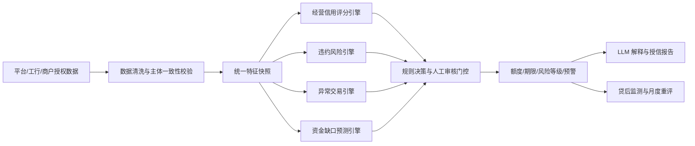

# 机器学习评分模块设计

> 适用项目：消费供给动态授信 MVP  
> 设计依据：`数据字典_完善版__含评分规则与消费承接能力_v5.xlsx`、`五个测试商户_结构化与非结构化数据.xlsx`、`技术架构.png`  
> 文档目的：统一产品、算法、后端和答辩口径，指导信用评分、违约风险、异常交易识别、资金缺口预测四项能力落地。

版本基线：v5 数据字典已同步到仓库 `data/`；v4 仅作历史版本。实现时必须使用 v5，避免漏掉新增的 V09。

## 1. 先给结论

1. 现有 5 个模拟商户是验收样例，不是训练集，不能据此声称已经训练出真实的违约概率模型。
2. 第一版应采用“可解释评分卡 + 人工审核规则 + 无监督异常检测 + 小样本时序预测”的混合架构。
3. 现有 `综合经营评分（0-100）` 应保留，名称建议统一为“消费供给经营信用分”；它与银行意义上的 `未来12个月违约概率 PD` 是两个不同输出。
4. 在没有真实还款标签前，系统只输出“违约风险等级/模拟风险指数”，`pd_12m` 必须标记为未校准，不应把模拟值展示为真实概率。
5. 当前表格可支持经营信用评分和商户级交叉验证异常；要实现交易级异常识别和资金缺口预测，还需要补充交易明细、月度现金流出、现金余额、应付款与还本付息计划等字段。
6. 大模型只负责材料抽取、风险原因归纳和报告生成，不直接决定分数、违约概率、异常结论或授信额度。

## 2. 模块边界与总体流程



统一原则：先生成带 `merchant_id`、`snapshot_date`、`feature_version` 的特征快照，再让四个引擎读取同一快照。这样可避免四套模型各自重复计算、指标口径不一致和未来数据泄漏。

## 3. 四项能力的产品定义

| 能力 | 核心问题 | 推荐输出 | 第一版算法 | 有真实历史数据后的升级模型 |
|---|---|---|---|---|
| 经营信用评分 | 商户经营是否真实、稳定、可持续，能否承接消费需求 | 0-100 分、A-E 等级、维度分、主要加减分原因 | 现有打分卡 + 缺失值与置信度处理 | 单调约束 GBDT/LightGBM，并保留评分卡为挑战者模型 |
| 违约风险 | 未来 12 个月是否发生严重逾期或违约 | 风险等级；有标签后输出 `pd_12m` | 规则风险带，概率字段标记未校准 | WOE+逻辑回归评分卡为基线，单调约束 GBDT 为主模型，再做概率校准 |
| 异常交易识别 | 流水是否存在刷流水、循环转账、异常时段、退款冲正等行为 | 异常分、异常事件列表、原因码、证据交易 | 规则 + MAD 稳健异常分 + 多源一致性校验 | Isolation Forest/LOF + 监督反欺诈模型的集成 |
| 资金缺口预测 | 未来 1-3 个月经营现金是否不足，缺口在什么区间 | P50/P90 缺口、缺口月份、主要驱动、情景结果 | 加权趋势/阻尼趋势 + 压力情景 | 分位数 LightGBM 或全局时序模型 + 保序/共形区间校准 |

## 4. 能力一：消费供给经营信用评分

### 4.1 保留现有评分框架

现有数据字典已定义以下核心维度：

- 经营稳定性评分：经营年限、有效经营月份、收款波动、现金流率、资产负债率、退款率等。
- 经营成长性评分：收款环比、近 6 个月复合增长、平台订单增长、经营计划可执行性。
- 经营真实性评分：发票/现金流/订单与收款的一致性、有效发票占比、资料异常数。
- 消费承接能力评分：订单规模、核销率、员工/技师数量、服务能力利用率、旺季增长。
- 非结构化经营评分：线上口碑、社媒活跃度、投诉风险。
- 数据完整性和法人授信状态调整。

第一版按 v5 规则计算：

```text
经营信用分 = 稳定性×30% + 成长性×20% + 真实性×20%
           + 非结构化经营×15% + 数据完整性×10%
           + 法人授信状态调整×5%
```

消费承接能力不再重复加进总分，而是进入额度微调和消费供给分析，避免同一订单、核销数据被多次计权。

### 4.2 必须保留的输出

- `operating_credit_score`：0-100。
- `credit_grade`：A/B/C/D/E。
- `dimension_scores`：稳定、成长、真实、承接、非结构化、完整性。
- `top_positive_reasons`：最多 3 项。
- `top_negative_reasons`：最多 3 项。
- `confidence`：高/中/低。
- `feature_coverage`：本次可用特征比例与关键缺失字段。
- `manual_review_rules`：V01-V09、L01-L04 的命中结果。
- `score_version`：例如 `scorecard_v5_2026_08`。

### 4.3 评分升级原则

拿到真实历史样本后，训练模型时应采用按时间切分而非随机切分；同一商户的多个快照不能同时出现在训练集和验证集。模型应尽量设置单调约束，例如退款率、投诉率、异常命中数上升不应让风险下降。最终保留“模型分 + 规则门控”：即使模型分高，命中主体不一致、流水异常、合同发票失败等规则仍应转人工。

## 5. 能力二：违约风险模型

### 5.1 标签定义

建议把标签写死在数据字典和模型卡中：

```text
观察时点：snapshot_date
表现窗口：snapshot_date 后 12 个月
default_12m = 1，当窗口内出现任一情况：
1. 最大逾期天数 >= 90 天；
2. 核销/坏账；
3. 因信用恶化发生实质性重组或代偿。
否则 default_12m = 0。
```

比赛 MVP 没有上述标签，因此：

- 可输出 `risk_band = 低/中/高/人工复核`；
- 可输出 `risk_index = 0-100`，但页面必须写“模拟风险指数”；
- `pd_12m` 返回 `null`，同时返回 `pd_status = UNCALIBRATED`；
- 不能用 5 个商户的画像类型作为违约标签训练分类器。

### 5.2 MVP 风险等级逻辑

1. 先运行 V01-V09，一票否决命中则输出“人工复核”，不自动给出通过结论。
2. 未命中一票否决时，结合经营信用分、现金流率、退款率、投诉风险、法人状态和数据置信度形成风险等级。
3. 对数据缺失型商户，风险不自动判高，但必须降低置信度并触发补件/人工复核。
4. 将风险等级与额度决策分开：风险低不等于额度一定高，额度还取决于经营规模、用途金额和消费承接能力。

### 5.3 真实数据阶段的模型组合

- 基线模型：WOE 分箱 + 逻辑回归。优点是可解释、易转换为评分卡。
- 主模型：带单调约束的 LightGBM/GBDT，处理非线性和变量交互。
- 概率校准：在独立时间验证集上进行 Isotonic 或 Platt 校准。
- 模型融合：主模型 PD 为主，逻辑回归作为挑战者；差异过大时进入模型监控或人工复核。
- 解释：使用特征贡献/SHAP 生成稳定的原因码，不让 LLM 自行猜测原因。

### 5.4 评估指标

- 区分能力：ROC-AUC、KS、PR-AUC。
- 概率准确性：Brier Score、校准曲线、预测/实际违约率分箱对比。
- 业务指标：固定审批率下的违约率、固定坏账率下的通过率、人工复核率。
- 稳定性：PSI、特征缺失率漂移、行业/城市分层表现。
- 验证方式：严格时间外验证，禁止用表现窗口内的信息作为特征。

## 6. 能力三：异常交易识别

### 6.1 当前数据的限制

当前 5 个商户只有月度收款汇总，最多能识别“订单趋势与流水背离、发票与流水差异、评价/订单比异常”等商户级异常，不能定位某一笔交易是否异常。要实现架构图中的异常交易预警，需新增交易明细表。

### 6.2 建议新增交易字段

| 字段 | 说明 |
|---|---|
| `merchant_id` | 商户唯一标识 |
| `transaction_id` | 脱敏交易标识 |
| `transaction_time` | 交易时间，精确到秒 |
| `direction` | 入账/出账 |
| `amount` | 交易金额 |
| `counterparty_hash` | 脱敏对手方标识 |
| `channel` | 收单、转账、现金、退款等 |
| `status` | 成功、撤销、冲正、退款 |
| `order_id_hash` | 可选，关联平台订单 |
| `invoice_id_hash` | 可选，关联发票 |
| `purpose_code` | 资金用途或交易摘要分类 |
| `is_business_hour` | 是否处于该行业/门店正常营业时段 |

### 6.3 三层检测

第一层：确定性规则，优先保证可解释性。

- 单日同金额大额交易重复 3 次及以上。
- 0-6 点等非营业时段交易占比突然升高。
- 单一对手方金额/笔数占比超过阈值。
- 入账后短时间等额或近等额转出。
- 退款、撤销、冲正形成闭环。
- 大量整数金额、尾数分布异常。
- 订单、发票、收款无法匹配。
- 月度流水增长与订单趋势显著背离。

第二层：无监督异常模型。

- 交易级/商户日级特征：金额对数、时间间隔、夜间标记、对手方集中度、滚动均值偏差、退款率、冲正率等。
- 小数据 MVP 可先使用中位数/MAD 稳健 Z 分数。
- 数据量扩大后使用 Isolation Forest 或 LOF，并按行业、城市、商户规模分群训练，避免把正常的大商户判成异常。

第三层：多源一致性校验。

- 流水与平台订单、核销、退款、发票、合同用途做关联。
- 异常模型只产生预警和证据链，不能单独直接拒贷。

### 6.4 异常输出

```json
{
  "merchant_id": "M005",
  "anomaly_score": 92,
  "risk_level": "HIGH",
  "reason_codes": ["REPEATED_ROUND_AMOUNT", "ORDER_CASHFLOW_DIVERGENCE"],
  "evidence_transaction_ids": ["T123", "T127"],
  "rule_hits": ["V04"],
  "model_version": "anomaly_hybrid_v1"
}
```

评估重点是 `Precision@K`、注入异常召回率、误报率、每日告警量和平均发现时延，不只看 AUC。

## 7. 能力四：资金缺口预测

### 7.1 与“消费供给缺口”区分

现有数据字典中的“消费供给缺口”描述商户还能承接多少消费增量，是产能/市场概念；“资金缺口”描述未来现金是否不够支付经营支出和债务，是流动性概念。两者必须在页面和字段名上区分：

- `supply_capacity_gap`：消费供给缺口，仅用于消费场景和扩张叙事。
- `cash_funding_gap`：资金缺口，用于融资需求和贷后预警。

### 7.2 建议公式

对未来第 t 月：

```text
期末现金_t = 期初现金_t
           + 预测经营现金流入_t
           - 预测经营现金流出_t
           - 计划资本开支_t
           - 到期还本付息_t

资金缺口_t = MAX(0, 最低安全现金余额 - 期末现金_t)
```

总缺口可输出未来 1、2、3 个月的最大缺口或累计缺口。P90 压力缺口应使用偏保守的流入预测与偏高的流出预测，而不是只给一个点估计。

### 7.3 必须新增的数据

- 至少 12 个月的月度经营现金流入和流出；最好 24 个月以上。
- 当前可用现金余额、受限资金和未使用授信。
- 未来 3 个月租金、工资、税费、采购、营销等计划支出。
- 贷款还本付息计划、应付账款到期计划。
- 已确认的大额订单、旺季计划、扩店/设备等资本开支。

现有表中只有部分商户的近 6 个月现金流入/流出合计，没有月度序列，因此不能可靠预测缺口，只能做粗略估算。

### 7.4 模型路线

- MVP：近 6-12 个月加权移动平均 + 阻尼趋势；以退款率、订单趋势和旺季增长做情景调整。
- 压力情景：流入下降、退款上升、工资/租金刚性、资本开支发生，输出 P50/P90。
- 数据扩大后：使用全商户共享的分位数 GBDT，特征包括 1/2/3/6/12 期滞后、滚动均值、滚动波动、行业和月份、订单/核销/退款、计划支出。
- 验证：滚动时间回测，指标使用 MAE、WAPE、方向准确率和 P90 区间覆盖率。

## 8. 数据表设计建议

| 表名 | 主键/粒度 | 用途 |
|---|---|---|
| `merchant_feature_snapshot` | 商户 + 快照日期 | 四个引擎共享的特征快照 |
| `loan_performance_label` | 贷款 + 观察时点 | 逾期、核销、重组等违约标签 |
| `transaction_detail` | 单笔交易 | 交易级异常识别 |
| `cashflow_monthly` | 商户 + 月份 | 月度流入、流出、余额、计划支出 |
| `model_prediction` | 商户 + 快照 + 模型版本 | 分数、风险、置信度、原因码 |
| `anomaly_event` | 异常事件 | 规则、模型分、证据交易、处置状态 |
| `cash_gap_forecast` | 商户 + 预测月份 + 情景 | P50/P90 流入、流出和资金缺口 |

所有派生特征都应保存 `as_of_time`，只使用申请时已经发生的数据。评价、投诉、退款、还款结果等不得穿越到观察时点之后。

## 9. 服务接口建议

### 9.1 一次性评分

`POST /api/v1/ml/score`

```json
{
  "merchant_id": "M001",
  "snapshot_date": "2026-08-01",
  "feature_version": "feature_v1",
  "features": {}
}
```

```json
{
  "operating_credit_score": 90.6,
  "credit_grade": "A",
  "risk_band": "LOW",
  "pd_12m": null,
  "pd_status": "UNCALIBRATED",
  "confidence": "HIGH",
  "manual_review_rules": [],
  "reason_codes": ["STABLE_CASHFLOW", "HIGH_AUTHENTICITY", "GOOD_REPUTATION"],
  "score_version": "scorecard_v5_2026_08"
}
```

### 9.2 交易异常

`POST /api/v1/ml/anomalies`

输入单笔或批量交易，输出异常事件和证据交易。规则阈值应放配置文件，不散落在代码中的 `if/elif`。

### 9.3 资金缺口

`POST /api/v1/ml/cash-gap`

输出未来 3 个月 P50/P90 流入、流出、期末现金、缺口及主要驱动。

### 9.4 报告解释

LLM 只读取上述结构化结果和原因码，生成经营总结、主要优势、主要风险和授信理由。若结构化结果为空或低置信度，LLM 必须明确提示，不得补造数值。

## 10. 现有 5 个商户的正确用途

| 商户 | 应验证的能力 | 不应作为 |
|---|---|---|
| 商户1 优质稳定型 | 高经营信用分、高置信度、正常授信路径 | “低违约”训练样本 |
| 商户2 成长型 | 成长加成、消费承接和扩张路径 | 真实正样本 |
| 商户3 风险型 | 负现金流、退款/投诉恶化、风险预警 | 真实违约样本 |
| 商户4 数据缺失型 | 缺失值、中性分、低/中置信度、补件 | 正常或违约样本 |
| 商户5 疑似异常型 | 主体不一致、刷流水、刷评和一票否决 | 普通高风险样本；它首先是欺诈/异常问题 |

它们应作为单元测试和端到端验收用例，要求每次修改评分或规则后仍能解释输出变化。

## 11. 开发顺序

### 第一阶段：先跑通确定性基线

1. 把 v5 Excel 规则转为版本化配置。
2. 实现特征计算和评分引擎。
3. 用“预期输出对照表（最终版）”逐项验收 5 个商户。
4. 实现 V01-V09、L01-L04，保证规则门控优先于自动授信。
5. 固定 `/score` 输入输出契约。

### 第二阶段：补齐两个数据短板

1. 为每个测试商户模拟交易明细，并注入可解释异常。
2. 将现金流入/流出拆为至少 12 个月序列，补当前现金和未来刚性支出。
3. 实现规则 + MAD 异常检测和 3 个月资金缺口基线预测。
4. 固定 `/anomalies`、`/cash-gap` 契约。

### 第三阶段：接入前端和报告

1. 银行端展示分数、置信度、风险原因、异常证据和资金缺口区间。
2. 商户端展示可改善项，不展示银行内部反欺诈阈值。
3. LLM 根据结构化结果生成报告，保留模型版本和证据追溯。

### 第四阶段：真实数据升级

1. 接入脱敏历史申请与贷后表现。
2. 建立时间外训练/验证/回测集。
3. 训练并校准 PD 模型，设置冠军/挑战者模型。
4. 监控漂移、校准、误报、人工复核率和分行业表现。

## 12. 答辩建议表述

建议使用下面的口径：

> 我们没有用 5 个模拟商户硬训练一个看似精确的违约概率模型。现阶段用可解释评分卡和规则门控保证结果可审计，用无监督模型发现未知异常，用分位数预测给出资金缺口区间；5 个商户用于全链路验收。系统的数据结构、标签定义和模型接口已经为后续接入工行脱敏历史数据并训练真实 PD 模型预留完成。

这个表述既体现算法设计完整性，也诚实说明当前数据边界。
